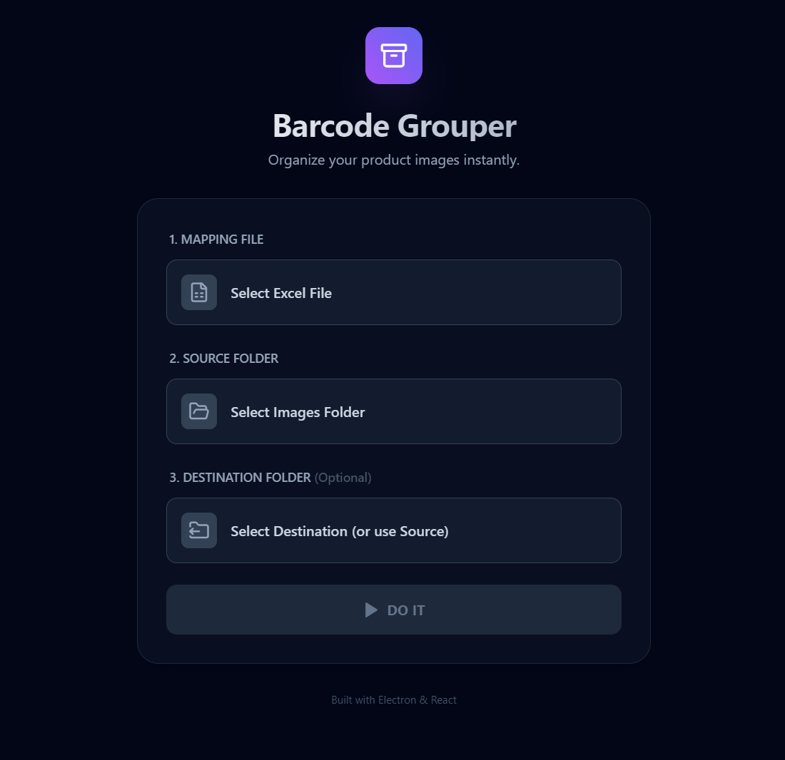

# Barcode Grouper

A simple app to organize your product images into folders using their barcodes.



## Features
-   **Excel Mapping**: Uses your Excel file to match images. (Col A: Barcode, Col B: Product Image Name)
-   **Automatic Sorting**: Just pick a folder, and it sorts everything for you.
-   **Safe & Private**: Runs 100% on your computer. Nothing is sent to the internet.
-   **Destination Control**: Optionally choose where the sorted folders go.
-   **Dark Mode**: A nice, easy-to-read dark theme.

## Installation

1.  **Download**: Go to the **Releases** section (on the right side of this page) and click to download `BarcodeGrouper_Release_v1.0.1.zip`.
2.  **Unzip**: Locate the downloaded file in your Downloads folder. **Right-Click** on it and select **Extract All...**. Click **Extract** to finish.
3.  **Run**: Opens the newly created folder and double-click the **Barcode Grouper** application (it might say `.exe` at the end).

*That's it! The app will open immediately. No complex installation required.*

## Development (For Developers)

### Prerequisites
-   Node.js (v18+)
-   NPM

### Setup
```bash
git clone https://github.com/louisuy/THAT-Barcode-Grouper.git
cd THAT-Barcode-Grouper
npm install
```

### Run Locally
```bash
npm run electron:dev
```

### Build
To build the portable executable:
```bash
npm run build
```
Output will be in `dist/win-unpacked`.

## Tech Stack
-   **Electron**
-   **React**
-   **TailwindCSS**
-   **XLSX**

## License
Proprietary - Majid Al Futtaim
